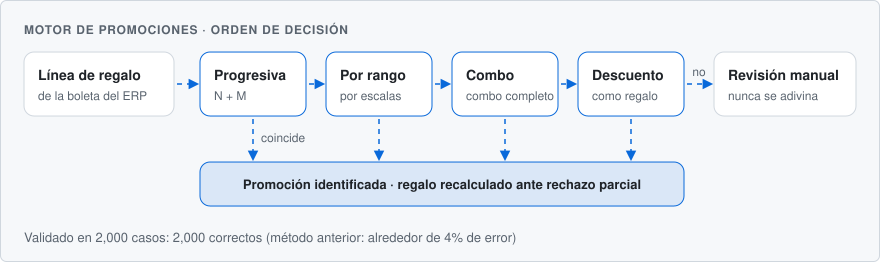

  <a href="https://github.com/ItaloFabioSinisiQ"><picture><source media="(prefers-color-scheme: dark)" srcset="assets/lang-en-dark.svg"></picture></a>
  <a href="https://github.com/ItaloFabioSinisiQ/ItaloFabioSinisiQ/blob/main/README.es.md"><picture><source media="(prefers-color-scheme: dark)" srcset="assets/lang-es-active-dark.svg"></picture></a>

<picture>
  <source media="(prefers-color-scheme: dark)" srcset="assets/header-es-dark.svg">
  
</picture>

   
  <a href="https://github.com/ItaloFabioSinisiQ/ItaloFabioSinisiQ/raw/main/cv/Italo-Sinisi-CV-ES.pdf"><picture><source media="(prefers-color-scheme: dark)" srcset="assets/cv-button-es-dark.svg"></picture></a>

  <a href="mailto:sinisiquintanaitalo@gmail.com"><b>Email</b></a> &nbsp;·&nbsp;
  <a href="https://www.linkedin.com/in/italo-fabio-sinisi-quintana/"><b>LinkedIn</b></a> &nbsp;·&nbsp;
  <a href="https://italofabiosinisiq.github.io/-dev-holaMundo-true-/"><b>Portafolio</b></a> &nbsp;·&nbsp;
  <a href="https://wa.me/51977170609"><b>WhatsApp</b></a>

## Sobre mí

Desarrollador Full Stack y Analista de Datos con más de 5 años de experiencia en software y datos. En **Auren**, distribuidora de consumo masivo en Perú, diseño, construyo y opero las plataformas del área de Inteligencia de Negocios para reparto de última milla, fuerza de ventas y reportes gerenciales. Cada sistema parte de la métrica de negocio que debe mover, y esa métrica se mide una vez que el sistema está en producción.

**Roles:** Full Stack Engineer · Backend Engineer (Python, FastAPI) · Software Engineer · Data Engineer · BI Developer 
**Disponibilidad:** remoto a tiempo completo o por contrato, proyectos freelance y roles presenciales en Lima · Zona horaria GMT-5 · Español nativo

<picture>
  <source media="(prefers-color-scheme: dark)" srcset="assets/approach-es-dark.svg">
  
</picture>

## Resultados destacados

<picture>
  <source media="(prefers-color-scheme: dark)" srcset="assets/impact-es-dark.svg">
  
</picture>

## Experiencia

<picture>
  <source media="(prefers-color-scheme: dark)" srcset="assets/journey-es-dark.svg">
  
</picture>

### Full Stack Developer, Inteligencia de Negocios — Auren
Distribución de consumo masivo · Lima, Perú · Diciembre 2025 – Actualidad

- Responsable del diseño, desarrollo, despliegue y operación de las plataformas internas del área de BI.
- Construí **RutaLiquidador**, la plataforma de reparto y liquidación de rutas que redujo la tasa de rechazo de pedidos **de 7% a 1%** y dio a la oficina control GPS en tiempo real de la flota.
- Construí aplicaciones de fuerza de ventas, un motor de concursos comerciales, reportes automáticos por WhatsApp y analítica de uso sobre el ERP de la empresa.
- Introduje despliegues con contenedores, pipelines de CI/CD y pruebas automatizadas en todos los proyectos.

### Analista de Datos de Call Center — UBYCALL
Call center tercerizado, cuenta de Pizza Hut Perú · Febrero 2023 – Noviembre 2024

- Aumenté la conversión de ventas en **15%** con análisis predictivo del comportamiento de los clientes.
- Automaticé el **80%** de los reportes manuales con Python y SQL, y construí dashboards gerenciales en Power BI.

### Analista Financiero — Alfin Banco
Banca · Marzo 2022 – Diciembre 2022

- Desarrollé modelos de scoring de riesgo crediticio que redujeron las pérdidas por impago en **18%**.
- Construí un pipeline ETL automatizado que procesa más de **100,000 transacciones por día**.

### Asistente Administrativo (prácticas) — Gestión Inmobiliaria Pacífico
Inmobiliaria · Mayo 2021 – Marzo 2022

- Reestructuré bases de datos internas con SQL y construí reportes en Power BI que redujeron el tiempo dedicado a tareas administrativas.

## Proyecto principal: RutaLiquidador

Plataforma de reparto de última milla, rastreo de flota y liquidación de rutas · repositorio privado, en uso diario en producción

Cada mañana la empresa despacha camiones por Lima, cada uno con una tripulación de tres a cuatro personas y decenas de paradas, y la señal móvil solo está disponible alrededor del 64% del turno. RutaLiquidador conecta el ERP, los camiones y la oficina. Los choferes confirman cada parada desde una app que funciona sin conexión, y la oficina sigue la flota en vivo y liquida cada ruta al céntimo.

<picture>
  <source media="(prefers-color-scheme: dark)" srcset="assets/case-metrics-es-dark.svg">
  
</picture>

### Cómo funciona

<picture>
  <source media="(prefers-color-scheme: dark)" srcset="assets/delivery-flow-es-dark.svg">
  
</picture>

### Problemas resueltos

| Problema | Solución |
|:---|:---|
| **Diferencias en la liquidación.** Con entregas parciales, nadie podía decir cuánto dinero debía entregar cada chofer. | Liquidación línea por línea contra el pedido del ERP, con decimales exactos y el peso real de los productos, separada por tripulante. |
| **Bonificaciones entregadas de más.** El ERP pierde el vínculo entre cada unidad de regalo y su promoción, así que en los rechazos parciales se regalaba producto de más. | Un motor que cubre 14 tipos de promoción. Acertó en 2,000 de 2,000 casos de validación, frente a un 4% de error del método anterior, y la app bloquea la cantidad correcta incluso sin conexión. |
| **Confirmaciones perdidas en rutas compartidas.** La confirmación de un segundo tripulante podía perderse sin aviso. | Una bitácora multiusuario con envíos firmados, resolución de conflictos en el servidor y auditoría completa. |
| **Fraude y mermas sin detectar.** Pedidos inflados, clientes ficticios y pérdidas de peso eran difíciles de ver. | Señales automáticas de pedidos inflados para superar el ticket mínimo, clientes marcados por los choferes, merma de peso anormal, rechazos registrados lejos del cliente y ritmos de entrega imposibles. |

<b>Cuatro problemas resueltos más</b>

 

| Problema | Solución |
|:---|:---|
| **Rechazos sin seguimiento.** Los pedidos recuperados después de un rechazo desaparecían de las estadísticas. | Gestión de rechazos que reconstruye el historial desde la auditoría y mide las ventas recuperadas, más una alerta inmediata por WhatsApp cuando quedan más de S/ 1,000 sin cobrar. |
| **Sin visibilidad de la flota.** La oficina no sabía dónde estaban los camiones ni qué rutas estaban detenidas. | Mapa de la flota en vivo mediante un proxy seguro al rastreador GPS, con cada ruta marcada como en curso, detenida, cerrada o sin iniciar. |
| **Conectividad poco confiable.** Las entregas sin enviar se acumulaban hasta que la evidencia en el celular se volvía ilegible. | Almacenamiento offline con cola local cifrada, tamaño acotado, retención de un día y sincronización automática. |
| **Reportes manuales.** Supervisores y gerencia armaban los reportes a mano. | Reportes programados de inicio, mediodía y cierre por correo y WhatsApp, sin envíos duplicados, y un análisis que baja de periodo a chofer, cliente y producto. |

### Motor de promociones

<picture>
  <source media="(prefers-color-scheme: dark)" srcset="assets/engine-flow-es-dark.svg">
  
</picture>

### Arquitectura

<picture>
  <source media="(prefers-color-scheme: dark)" srcset="assets/architecture-es-dark.svg">
  
</picture>

### Ingeniería

- **Calidad:** más de 7,700 tests automatizados (pytest, Jest, Vitest, Playwright) y mutation testing en cada pull request.
- **Despliegue:** seis workflows de CI controlan cada release. Los despliegues están automatizados con backup, smoke test y rollback automático, con unos 15 segundos de interrupción.
- **Rendimiento:** reescribir una consulta llevó una ruta crítica de 4.9 s a 7 ms (unas 700 veces más rápida).
- **Decisiones basadas en datos:** los choques entre tripulantes se midieron antes de construir la pantalla de conflictos, y la hora de la alerta de cierre se fijó con datos reales de las paradas. Se retiró un proceso sin uso que escribía 278,000 filas al día.
- **Desarrollo asistido por IA, con control:** uso herramientas de IA a diario, y cada cambio igual debe pasar tests, mutation testing y CI.

**Stack:** Python · FastAPI · SQLAlchemy · Alembic · PostgreSQL · SQL Server · TypeScript · React · Vite · Tailwind CSS · React Native · Expo · MapLibre · OSRM · Docker · Nginx · GitHub Actions

## Otros proyectos

| Proyecto | Resultado |
|:---|:---|
| **Ventory Multicanal** Plataforma de fuerza de ventas | Permite a las empresas verificar a su fuerza de ventas en campo. Registra asistencia con selfie y GPS, detecta ubicaciones falsas, celulares rooteados y velocidades imposibles, y sincroniza ventas offline sin duplicar ninguna. Una edición para venta de internet por fibra valida la cobertura en el mismo celular. <i>FastAPI · PostgreSQL · React Native · React</i> |
| **Portal de Concursos** Motor de concursos comerciales | Convierte las reglas de cada concurso en consultas de solo lectura al ERP y recalcula 14 concursos cada día hábil. Validado con **cero diferencias en 281,788 filas**. <i>Next.js · FastAPI · SQL Server</i> |
| **Capturas de Preventa** Bot de reportes de preventa | Reemplazó un proceso manual: envía 225 combinaciones de reportes a grupos de WhatsApp de forma programada y sin duplicados. Cubierto por unos 350 tests. En producción. <i>Python · FastAPI · Playwright · Node.js</i> |
| **AurenPulse** Analítica de uso interno | Muestra a la gerencia quién usa cada sistema interno, cuánto tiempo y quién dejó de usarlo. Es de solo lectura en dos niveles y su login tiene protección contra fuerza bruta. <i>FastAPI · PostgreSQL · Docker</i> |
| **AUSPEX** Dashboard de supervisores de ventas | Da a los supervisores rankings del equipo en vivo, alertas de inactividad y acceso auditado. La migración a Node.js, PostgreSQL y React Native está en curso. <i>Google Apps Script · Node.js · TypeScript</i> |
| **TomaPedidos** Motor de pedido sugerido · en diseño | Sugerirá qué ofrecer a cada cliente a partir de ciclos de recompra y afinidad de canasta, validado al reproducir nueve años de historial de ventas. <i>Python · PostgreSQL · LightGBM</i> |

Estos sistemas pertenecen a las empresas para las que los construyo, por eso los repositorios son privados. Con gusto explico la arquitectura y el código en una entrevista.

## Habilidades

| Área | Tecnologías |
|:---|:---|
| Backend | Python, FastAPI, SQLAlchemy, Alembic, Pydantic, APScheduler, Node.js, Express, Prisma, APIs REST, JWT |
| Frontend | TypeScript, React, Next.js, Vite, Tailwind CSS, Leaflet, MapLibre, Recharts, ECharts |
| Móvil | React Native, Expo, sincronización offline-first, almacenamiento local cifrado, GPS en segundo plano |
| Datos y BI | PostgreSQL, SQL Server, SQLite, pipelines ETL, integración con ERP, Pandas, scikit-learn, Power BI (DAX) |
| DevOps y calidad | Docker, Docker Compose, Nginx, Linux, GitHub Actions, pytest, Jest, Vitest, Playwright, mutation testing |
| Lenguajes | Python, TypeScript, JavaScript, SQL, Rust |
| Sectores | Logística y reparto de última milla, fuerza de ventas, consumo masivo, riesgo crediticio, inteligencia de negocios |

## Educación y certificaciones

- **Ingeniería de Sistemas Computacionales** — Universidad Privada del Norte (UPN) en curso
- Microsoft Certified: Power BI Data Analyst Associate (PL-300)
- Certified ScrumMaster (CSM) — Scrum Alliance
- Certificación Genesys Cloud — Genesys
- Python y Análisis de Datos · Bases de Datos SQL · Desarrollo de APIs REST — EDTEAM

Actualmente preparando la certificación AWS Certified Solutions Architect – Associate.

---

  Abierto a nuevas oportunidades. La forma más rápida de contactarme es por <a href="mailto:sinisiquintanaitalo@gmail.com">correo</a>, o <a href="https://github.com/ItaloFabioSinisiQ/ItaloFabioSinisiQ/raw/main/cv/Italo-Sinisi-CV-ES.pdf">descarga mi CV</a>.

