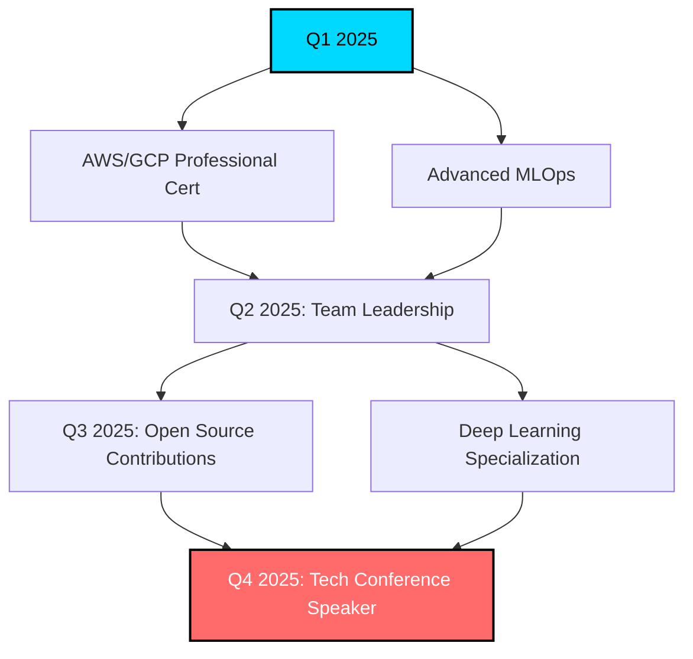

# 🚀 Italo Fabio Sinisi Quintana

<div align="center">
  
[](https://git.io/typing-svg)

[](https://www.linkedin.com/in/italo-fabio-sinisi-quintana/)
[](https://wa.me/51977170609)
[](mailto:sinisiquintanaitalo@gmail.com)

**Data Analyst | Cloud Computing | Machine Learning Enthusiast**


</div>

---

## 🎯 Sobre Mí

**Data Analyst especializado** con más de **3 años de experiencia** transformando datos complejos en insights accionables que impulsan el crecimiento empresarial. Mi enfoque combina análisis técnico profundo con visión estratégica de negocio.

```python
class ItaloSinisi:
    def __init__(self):
        self.role = "Senior Data Analyst"
        self.experience = "3+ años"
        self.location = "Lima, Perú 🇵🇪"
        self.passion = ["Data Science", "Cloud Architecture", "AI/ML"]
        self.mission = "Democratizar el poder de los datos"
        self.current_focus = "Machine Learning & Cloud Engineering"
    
    def get_expertise(self):
        return {
            "data_analysis": ["Statistical Analysis", "Predictive Modeling", "A/B Testing"],
            "cloud_platforms": ["AWS", "GCP", "Azure", "Databricks"],
            "programming": ["Python", "SQL", "JavaScript", "R"],
            "visualization": ["Power BI", "Tableau", "Plotly", "D3.js"],
            "big_data": ["Apache Spark", "ETL Pipelines", "Data Warehousing"],
            "methodologies": ["Agile/SCRUM", "DataOps", "MLOps"]
        }
    
    def career_highlights(self):
        return [
            "🚀 15% increase in conversion rates through advanced analytics",
            "⚡ 60% reduction in data processing time via automation",
            "📊 Developed 20+ interactive dashboards for C-level executives",
            "🎯 Led data-driven initiatives impacting 100K+ customers"
        ]
```

---

## 🛠️ Arsenal Tecnológico

<div align="center">

### 💻 Lenguajes de Programación


### ☁️ Cloud & Big Data Ecosystem


### 📊 Data Science & Analytics


### 📈 Visualization & BI Tools


### 🔧 Development & Infrastructure


</div>

---

## 💼 Trayectoria Profesional

### 🏢 UBYCALL – Pizza Hut Salvador
**🎯 Analista de Datos Call Center** | *Feb 2023 - Nov 2024*

- 📈 **Incrementé conversiones en 15%** mediante análisis predictivo de comportamiento de clientes
- 🔍 Desarrollé sistema de alertas en tiempo real para identificación temprana de tendencias
- 📊 Implementé dashboards ejecutivos que redujeron tiempo de toma de decisiones en 40%
- 👥 Lideré iniciativas de data-driven optimization que impactaron a 50+ agentes
- 🤖 Automaticé 80% de reportes manuales usando Python y SQL avanzado

**Logros Clave:**
- 🎯 ROI de 300% en proyectos de optimización basados en datos
- 📞 Mejora del 25% en customer satisfaction score
- ⚡ Reducción del 35% en tiempo promedio de llamadas

### 🏦 ALFIN BANCO
**💰 Analista Financiero** | *Mar 2022 - Dic 2022*

- 🎯 **Reduje la tasa de impagos** mediante modelos de machine learning para scoring crediticio
- 📋 Desarrollé pipeline ETL automatizado procesando 100K+ transacciones diarias
- 💡 Creé sistema de early warning para riesgos financieros
- ⚡ Optimicé procesos de reporting reduciendo tiempo manual en 70%

**Impacto Medible:**
- 📉 Reducción del 18% en pérdidas por impagos
- 🚀 Incremento del 22% en eficiencia operacional
- 📊 Automatización de 15+ reportes regulatorios

---

## 🚀 Proyectos Destacados

<div align="center">

| 🎯 Proyecto | 🛠️ Stack Tecnológico | 📈 Impacto Business |
|-------------|----------------------|-------------------|
| **🔄 Data Pipeline Inteligente** | Python, Apache Airflow, AWS S3, Redshift | 60% ↓ tiempo procesamiento |
| **📈 Dashboard Predictivo 360°** | Power BI, ML.NET, Azure Functions | 15% ↑ conversiones |
| **🎯 Credit Risk ML Model** | Python, Scikit-learn, XGBoost, MLflow | 18% ↓ default rate |
| **📞 Real-time Call Analytics** | Genesys Cloud API, Kafka, Elasticsearch | 25% ↑ customer satisfaction |
| **🤖 Automated Reporting Suite** | Python, Flask, Docker, PostgreSQL | 70% ↓ manual work |

</div>

---

## 📊 GitHub Statistics

<div align="center">
  


</div>

---

## 🏆 Certificaciones & Formación

<div align="center">

| 🎓 Institución | 📜 Certificación | 🗓️ Estado |
|---------------|------------------|-----------|
| **SENCICO** | Administración de Obras | ✅ Completado |
| **EDTEAM** | Python & Advanced Data Analysis | ✅ Certificado |
| **EDTEAM** | SQL Database Management Pro | ✅ Certificado |
| **Microsoft** | Power BI Data Analyst Associate | ✅ Certificado |
| **EDTEAM** | REST API Development | ✅ Certificado |
| **Genesys** | Cloud Platform Certified | ✅ Certificado |
| **Scrum Alliance** | Certified ScrumMaster (CSM) | ✅ Certificado |
| **AWS** | Solutions Architect Associate | 🎯 En progreso |

</div>

---

## 🎯 Roadmap 2025



**🚀 Objetivos Estratégicos:**
- 🤖 **Deep Learning & NLP:** Especializarme en modelos de lenguaje y computer vision
- ☁️ **Cloud Architecture:** Obtener certificaciones AWS/GCP Professional
- 👥 **Technical Leadership:** Liderar equipos multidisciplinarios de Data Science
- 🌟 **Open Source:** Contribuir a proyectos que impacten la comunidad global
- 🎤 **Knowledge Sharing:** Ser speaker en conferencias internacionales de tecnología

---

## 📈 Contribuciones & Actividad

<div align="center">


</div>

---

## 🌟 Skills Radar

<div align="center">

```
         Data Analysis ████████████ 95%
      Machine Learning ██████████░░ 85%
     Cloud Computing ███████████░ 90%
          Visualization ████████████ 95%
                    SQL ████████████ 95%
                 Python ███████████░ 90%
           Leadership ████████░░░░ 70%
      DevOps/MLOps ███████░░░░░ 60%
```

</div>

---

## 💡 Philosophy & Values

> *"En la era de la información, los datos son el activo más valioso, pero su verdadero poder se libera cuando se transforman en decisiones inteligentes que crean impacto real en las personas."*

**🔑 Principios Fundamentales:**
- **Data-Driven Decision Making:** Cada decisión debe estar respaldada por evidencia sólida
- **Continuous Learning:** La tecnología evoluciona, yo también
- **Collaboration:** Los mejores insights surgen del trabajo en equipo
- **Ethics in AI:** Responsabilidad y transparencia en cada modelo
- **Business Impact:** La técnica al servicio de resultados medibles

---

## 📫 Let's Connect & Collaborate!

<div align="center">

**🤝 ¿Tienes un proyecto desafiante? ¡Colaboremos!**

[](https://www.linkedin.com/in/italo-fabio-sinisi-quintana/)
[](https://wa.me/51977170609)
[](mailto:sinisiquintanaitalo@gmail.com)

---


**⭐ Si mi trabajo te inspira, no olvides dar una estrella a mis repositorios ⭐**

*"Los datos son el nuevo petróleo, pero la analítica es la refinería que crea valor real"* 📊✨

---

<div align="center">
<sub>🚀 Built with passion by <a href="https://github.com/ItaloFabioSinisiQ">Italo Sinisi</a> | Last updated: June 2025</sub>
</div>

</div>
