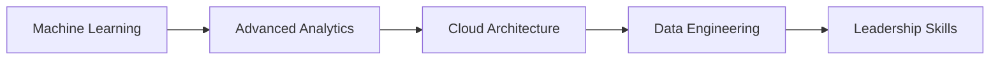

# 🚀 Italo Fabio Sinisi Quintana

<div align="center">
  
[](https://www.linkedin.com/in/italo-fabio-sinisi-quintana/)
[](https://wa.me/51977170609)
[](mailto:sinisiquintanaitalo@gmail.com)

*Data Analyst | Cloud Computing | Machine Learning Enthusiast*

</div>

---

## 👨‍💻 Sobre Mí

**Data Analyst especializado** con más de **3 años de experiencia** transformando datos en insights accionables. Mi pasión por la tecnología y el análisis de datos me impulsa a crear soluciones innovadoras que generen valor empresarial real.

```python
class ItaloSinisi:
    def __init__(self):
        self.role = "Data Analyst"
        self.experience = "3+ años"
        self.location = "Lima, Perú"
        self.passion = ["Data Analysis", "Cloud Computing", "Machine Learning"]
        self.mission = "Impulsar decisiones basadas en datos"
    
    def get_skills(self):
        return {
            "languages": ["Python", "SQL", "JavaScript"],
            "cloud": ["AWS", "GCP", "Azure"],
            "visualization": ["Power BI", "Tableau", "Excel"],
            "data_engineering": ["ETL", "Apache Spark", "Databricks"],
            "methodologies": ["SCRUM", "Agile"]
        }
```

---

## 🛠️ Stack Tecnológico

<div align="center">

### 💻 Lenguajes & Herramientas


### ☁️ Cloud & Big Data


### 📊 Análisis & Visualización


### 🔧 Desarrollo & Productividad


</div>

---

## 💼 Experiencia Profesional

### 🏢 UBYCALL – Pizza Hut Salvador
**Analista de Datos Call Center** | *Feb 2023 - Nov 2024*

- 📈 **Incrementé las conversiones en 15%** mediante análisis de KPIs y optimización de procesos
- 🔍 Desarrollé sistema de informes para identificar patrones en llamadas, mejorando la satisfacción del cliente
- 📊 Creé dashboards interactivos en Power BI para monitoreo en tiempo real
- 👥 Supervisé equipos de agentes optimizando procesos mediante análisis de datos

### 🏦 ALFIN BANCO
**Analista Financiero** | *Mar 2022 - Dic 2022*

- 🎯 **Reduje el porcentaje de impagos** mediante modelos de riesgo financiero optimizados
- 📋 Automaticé procesos con Python, mejorando la eficiencia en generación de informes
- 💡 Implementé tableros en Power BI para seguimiento efectivo de clientes
- ⚡ Desarrollé scripts de automatización para recopilación de datos

---

## 📊 Proyectos Destacados

<div align="center">

| Proyecto | Tecnologías | Impacto |
|----------|-------------|---------|
| 🔄 **Sistema ETL Automatizado** | Python, SQL, AWS | Reducción 60% tiempo procesamiento |
| 📈 **Dashboard Predictivo** | Power BI, Machine Learning | Incremento 15% conversiones |
| 🎯 **Modelo de Riesgo Financiero** | Python, Scikit-learn | Reducción impagos significativa |
| 📞 **Análisis Call Center** | Genesys Cloud, SQL | Mejora satisfacción cliente |

</div>

---

## 📈 GitHub Analytics

<div align="center">
  
[](https://github.com/TU_USERNAME)

[](https://github.com/TU_USERNAME)

</div>

---

## 🎓 Formación & Certificaciones

- 🏗️ **Egresado en Administración de Obras** - SENCICO
- 🐍 **Python & Data Analysis** - EDTEAM
- 💾 **SQL Database Management** - EDTEAM
- 📊 **Power BI Specialist** - EDTEAM
- 🌐 **REST API Development** - EDTEAM
- ☁️ **Genesys Cloud Certified**
- 🔄 **SCRUM Methodology**

---

## 🎯 Objetivos 2025



- 🤖 Profundizar en **Machine Learning** y **Deep Learning**
- ☁️ Obtener certificaciones **AWS/GCP Professional**
- 👥 Liderar equipos de **Data Science**
- 🚀 Contribuir a proyectos **Open Source**

---

## 📫 ¡Conectemos!

<div align="center">

**¿Tienes un proyecto interesante? ¡Hablemos!**

[](https://www.linkedin.com/in/italo-fabio-sinisi-quintana/)
[](https://wa.me/51977170609)
[](mailto:sinisiquintanaitalo@gmail.com)

---

*"Los datos son el nuevo petróleo, pero la analítica es la refinería"* 📊✨

**⭐ Si te gusta mi trabajo, no olvides dar una estrella a mis repositorios**

</div>
