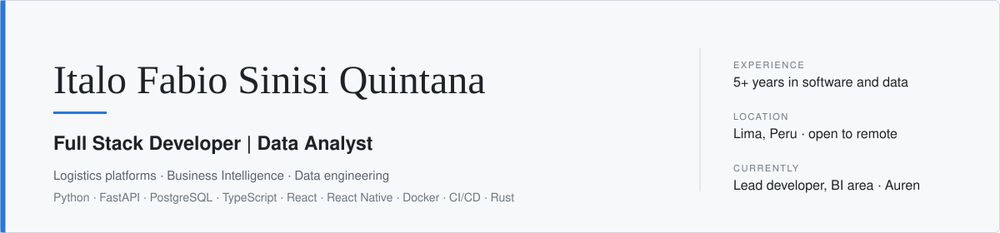
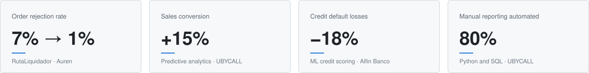
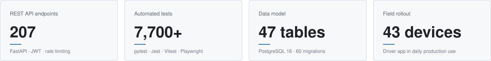

  <a href="https://github.com/ItaloFabioSinisiQ"><picture><source media="(prefers-color-scheme: dark)" srcset="assets/lang-en-active-dark.svg"></picture></a>
  <a href="https://github.com/ItaloFabioSinisiQ/ItaloFabioSinisiQ/blob/main/README.es.md"><picture><source media="(prefers-color-scheme: dark)" srcset="assets/lang-es-dark.svg"></picture></a>

<picture>
  <source media="(prefers-color-scheme: dark)" srcset="assets/header-dark.svg">
  
</picture>

   
  <a href="mailto:sinisiquintanaitalo@gmail.com"><b>Email</b></a> &nbsp;·&nbsp;
  <a href="https://www.linkedin.com/in/italo-fabio-sinisi-quintana/"><b>LinkedIn</b></a> &nbsp;·&nbsp;
  <a href="https://italofabiosinisiq.github.io/-dev-holaMundo-true-/"><b>Portfolio</b></a> &nbsp;·&nbsp;
  <a href="https://wa.me/51977170609"><b>WhatsApp</b></a>

## About

Full Stack Developer and Data Analyst with 5+ years of experience in software and data. At **Auren**, an FMCG distributor in Peru, I design, build and run the Business Intelligence area's platforms for last-mile delivery, field sales and executive reporting. I start every system from the business metric it has to move, and I measure that metric once the system is in production.

**Roles:** Full Stack Engineer · Backend Engineer (Python, FastAPI) · Software Engineer · Data Engineer · BI Developer 
**Availability:** remote full-time or contract, freelance projects, and on-site roles in Lima · Time zone GMT-5 · Spanish (native)

## Selected results

<picture>
  <source media="(prefers-color-scheme: dark)" srcset="assets/impact-dark.svg">
  
</picture>

## Experience

### Full Stack Developer, Business Intelligence — Auren
FMCG distribution · Lima, Peru · December 2025 – Present

- Responsible for the design, development, deployment and operation of the BI area's internal platforms.
- Built **RutaLiquidador**, the delivery and route settlement platform that reduced the order rejection rate **from 7% to 1%** and gave the office real-time GPS control of the truck fleet.
- Built field sales applications, a sales contest engine, automated WhatsApp reporting and usage analytics on top of the company ERP.
- Introduced containerized deployments, CI/CD pipelines and automated testing across projects.

### Call Center Data Analyst — UBYCALL
Contact-center outsourcer, Pizza Hut Peru account · February 2023 – November 2024

- Increased sales conversion by **15%** through predictive analysis of customer behavior.
- Automated **80%** of manual reporting with Python and SQL, and built executive dashboards in Power BI.

### Financial Analyst — Alfin Banco
Banking · March 2022 – December 2022

- Developed machine learning credit-scoring models that reduced default losses by **18%**.
- Built an automated ETL pipeline processing more than **100,000 transactions per day**.

## Featured project: RutaLiquidador

Last-mile delivery, fleet tracking and route settlement platform · private repository, in daily production use

Each morning the company dispatches trucks across Lima, each with a crew of three to four people and dozens of stops, and mobile signal is available only about 64% of the shift. RutaLiquidador connects the ERP, the trucks and the office. Drivers confirm every stop from an offline-first mobile app, and the office follows the fleet live and settles each route to the cent.

<picture>
  <source media="(prefers-color-scheme: dark)" srcset="assets/case-metrics-dark.svg">
  
</picture>

### Problems solved

| Problem | Solution |
|:---|:---|
| **Settlement disputes.** With partial deliveries, nobody could say how much money each driver owed. | Line-by-line settlement against the ERP order, in exact decimals and with real product weights, split per crew member. |
| **Over-delivered promotional units.** The ERP loses the link between free units and their promotion, so partial rejections gave away too much product. | An engine covering 14 promotion types. It was correct in 2,000 of 2,000 validation cases, where the previous method failed in about 4%, and the app locks the right quantity even offline. |
| **Lost confirmations in shared routes.** A second crew member's confirmation could be silently lost. | A multi-user delivery log with signed submissions, server-side conflict resolution and a full audit trail. |
| **Fraud and losses going unnoticed.** Inflated orders, fictitious customers and weight losses were hard to spot. | Automatic signals for orders inflated past the minimum order value, customers flagged by drivers, abnormal weight loss, rejections logged far from the customer and an impossible delivery pace. |

<b>Four more problems solved</b>

 

| Problem | Solution |
|:---|:---|
| **Rejections with no follow-up.** Orders recovered after a rejection disappeared from the statistics. | Rejection management that rebuilds history from the audit log and measures recovered sales, plus an instant WhatsApp alert when more than PEN 1,000 is left uncollected. |
| **No visibility of the fleet.** The office could not see where trucks were or which routes were stuck. | A live fleet map through a secure proxy to the GPS tracker, with each route marked as in progress, stalled, closed or not started. |
| **Unreliable connectivity.** Unsent deliveries piled up until the evidence on the phone became unreadable. | Offline-first storage with an encrypted local queue, bounded size, one-day retention and automatic sync. |
| **Manual reporting.** Supervisors and management assembled reports by hand. | Scheduled start, midday and closing reports by email and WhatsApp, with no duplicate sends, and a drill-down from period to driver, customer and product. |

### Architecture

<picture>
  <source media="(prefers-color-scheme: dark)" srcset="assets/architecture-dark.svg">
  
</picture>

### Engineering

- **Quality:** more than 7,700 automated tests (pytest, Jest, Vitest, Playwright) and mutation testing on pull requests.
- **Delivery:** six CI workflows gate every release. Releases are scripted with a backup, a smoke test and automatic rollback, with about 15 seconds of downtime.
- **Performance:** a query rewrite took a critical path from 4.9 s to 7 ms (about 700× faster).
- **Data-driven decisions:** collisions were measured before the conflict screen was built, and the end-of-day alert time was set from real stop data. An unused job writing 278,000 rows a day was retired.
- **AI-assisted, review-gated:** I use AI coding tools every day, and every change still has to pass tests, mutation testing and CI.

**Stack:** Python · FastAPI · SQLAlchemy · Alembic · PostgreSQL · SQL Server · TypeScript · React · Vite · Tailwind CSS · React Native · Expo · MapLibre · OSRM · Docker · Nginx · GitHub Actions

## Other projects

| Project | Outcome |
|:---|:---|
| **Ventory Multicanal** Field sales platform | Lets companies verify their field sales teams. It handles selfie and GPS attendance, detects fake locations, rooted devices and impossible travel speeds, and syncs offline sales without ever duplicating one. A fiber internet edition checks coverage on the device. <i>FastAPI · PostgreSQL · React Native · React</i> |
| **Portal de Concursos** Sales contest engine | Turns each contest's rules into read-only ERP queries and recalculates 14 contests every business day. Validated with **zero discrepancies across 281,788 rows**. <i>Next.js · FastAPI · SQL Server</i> |
| **Capturas de Preventa** Pre-sales report bot | Replaced a manual process by delivering 225 report combinations to WhatsApp groups on a schedule, with no duplicate sends. Covered by about 350 tests. In production. <i>Python · FastAPI · Playwright · Node.js</i> |
| **AurenPulse** Internal usage analytics | Shows leadership who uses each internal system, for how long, and who stopped using it. It is read-only at two levels and its login has brute-force protection. <i>FastAPI · PostgreSQL · Docker</i> |
| **AUSPEX** Sales supervisor dashboard | Gives supervisors live team rankings, inactivity alerts and audited access. A migration to Node.js, PostgreSQL and React Native is in progress. <i>Google Apps Script · Node.js · TypeScript</i> |
| **TomaPedidos** Order suggestion engine · in design | Will suggest what to offer each customer from repurchase cycles and basket affinity, validated by replaying nine years of sales history. <i>Python · PostgreSQL · LightGBM</i> |

These systems belong to the companies I build them for, so the repositories are private. I'm happy to walk through the architecture and code in an interview.

## Skills

| Area | Technologies |
|:---|:---|
| Backend | Python, FastAPI, SQLAlchemy, Alembic, Pydantic, APScheduler, Node.js, Express, Prisma, REST APIs, JWT |
| Frontend | TypeScript, React, Next.js, Vite, Tailwind CSS, Leaflet, MapLibre, Recharts, ECharts |
| Mobile | React Native, Expo, offline-first sync, encrypted local storage, background GPS |
| Data and BI | PostgreSQL, SQL Server, SQLite, ETL pipelines, ERP integration, Pandas, scikit-learn, Power BI (DAX) |
| DevOps and quality | Docker, Docker Compose, Nginx, Linux, GitHub Actions, pytest, Jest, Vitest, Playwright, mutation testing |
| Languages | Python, TypeScript, JavaScript, SQL, Rust |
| Domains | Logistics and last-mile delivery, field sales, FMCG distribution, credit risk, business intelligence |

## Education and certifications

- **Bachelor's in Systems & Computer Engineering** — Universidad Privada del Norte (UPN) in progress
- Microsoft Certified: Power BI Data Analyst Associate (PL-300)
- Certified ScrumMaster (CSM) — Scrum Alliance
- Genesys Cloud certification — Genesys
- Python and Data Analysis · SQL Databases · REST API Development — EDTEAM

Currently preparing for AWS Certified Solutions Architect – Associate.

---

  Open to new opportunities. The fastest way to reach me is <a href="mailto:sinisiquintanaitalo@gmail.com">email</a>.

