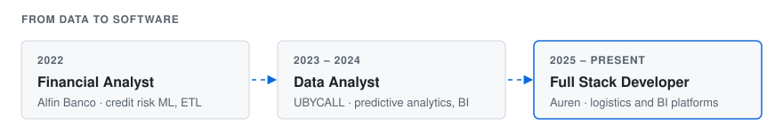
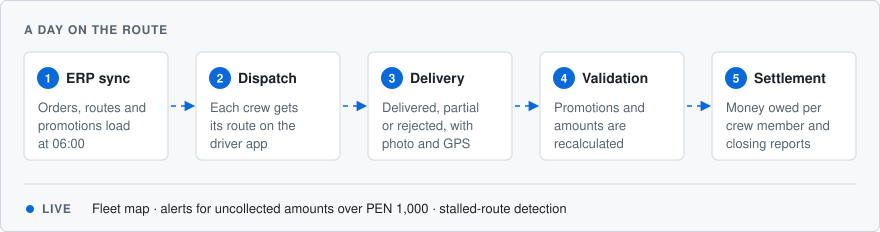
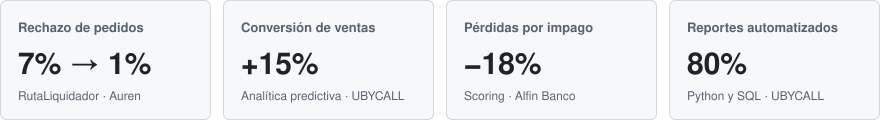
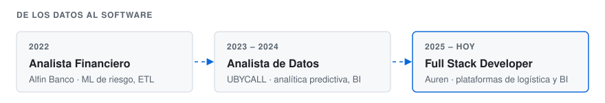
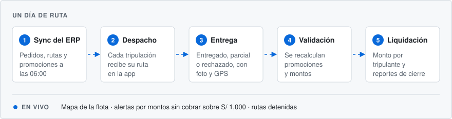

  <a href="https://github.com/settings/appearance"><picture><source media="(prefers-color-scheme: dark)" srcset="assets/theme-dark.svg"></picture></a>
  <a href="https://github.com/ItaloFabioSinisiQ/ItaloFabioSinisiQ/raw/main/cv/Italo-Sinisi-CV-EN.pdf"><picture><source media="(prefers-color-scheme: dark)" srcset="assets/cv-button-dark.svg"></picture></a>
  <a href="#english"><picture><source media="(prefers-color-scheme: dark)" srcset="assets/lang-en-active-dark.svg"></picture></a>
  <a href="#espanol"><picture><source media="(prefers-color-scheme: dark)" srcset="assets/lang-es-dark.svg"></picture></a>

<picture>
  <source media="(prefers-color-scheme: dark)" srcset="assets/header-dark.svg">
  
</picture>

   
  <a href="mailto:sinisiquintanaitalo@gmail.com"><b>Email</b></a> &nbsp;·&nbsp;
  <a href="https://www.linkedin.com/in/italo-fabio-sinisi-quintana/"><b>LinkedIn</b></a> &nbsp;·&nbsp;
  <a href="https://italofabiosinisiq.github.io/-dev-holaMundo-true-/"><b>Portfolio</b></a> &nbsp;·&nbsp;
  <a href="https://wa.me/51977170609"><b>WhatsApp</b></a>

## About

Full Stack Developer and Data Analyst with 5+ years of experience in software and data. At **Auren**, an FMCG distributor in Peru, I design, build and run the Business Intelligence area's platforms for last-mile delivery, field sales and executive reporting. I start every system from the business metric it has to move, and I measure that metric once the system is in production.

**Roles:** Full Stack Engineer · Backend Engineer (Python, FastAPI) · Software Engineer · Data Engineer · BI Developer 
**Availability:** remote full-time or contract, freelance projects, and on-site roles in Lima · Time zone GMT-5 · Spanish (native)

<picture>
  <source media="(prefers-color-scheme: dark)" srcset="assets/approach-dark.svg">
  
</picture>

## Selected results

<picture>
  <source media="(prefers-color-scheme: dark)" srcset="assets/impact-dark.svg">
  
</picture>

## Experience

<picture>
  <source media="(prefers-color-scheme: dark)" srcset="assets/journey-dark.svg">
  
</picture>

### Full Stack Developer, Business Intelligence — Auren
FMCG distribution · Lima, Peru · December 2025 – Present

- Responsible for the design, development, deployment and operation of the BI area's internal platforms.
- Built **RutaLiquidador**, the delivery and route settlement platform that reduced the order rejection rate **from 7% to 1%** and gave the office real-time GPS control of the truck fleet.
- Built field sales applications, a sales contest engine, automated WhatsApp reporting and usage analytics on top of the company ERP.
- Introduced containerized deployments, CI/CD pipelines and automated testing across projects.

### Call Center Data Analyst — UBYCALL
Contact-center outsourcer, Pizza Hut Peru account · February 2023 – November 2024

- Increased sales conversion by **15%** through predictive analysis of customer behavior.
- Automated **80%** of manual reporting with Python and SQL, and built executive dashboards in Power BI.

### Financial Analyst — Alfin Banco
Banking · March 2022 – December 2022

- Built credit-risk scoring models that reduced default losses by **18%**.
- Built an automated ETL pipeline processing more than **100,000 transactions per day**.

### Administrative Assistant (internship) — Gestión Inmobiliaria Pacífico
Real estate · May 2021 – March 2022

- Restructured internal databases with SQL and built Power BI reports that reduced time spent on administrative tasks.

## Featured project: RutaLiquidador

Last-mile delivery, fleet tracking and route settlement platform · private repository, in daily production use

Each morning the company dispatches trucks across Lima, each with a crew of three to four people and dozens of stops, and mobile signal is available only about 64% of the shift. RutaLiquidador connects the ERP, the trucks and the office. Drivers confirm every stop from an offline-first mobile app, and the office follows the fleet live and settles each route to the cent.

<picture>
  <source media="(prefers-color-scheme: dark)" srcset="assets/case-metrics-dark.svg">
  
</picture>

### How it works

<picture>
  <source media="(prefers-color-scheme: dark)" srcset="assets/delivery-flow-dark.svg">
  
</picture>

### Problems solved

| Problem | Solution |
|:---|:---|
| **Settlement disputes.** With partial deliveries, nobody could say how much money each driver owed. | Line-by-line settlement against the ERP order, in exact decimals and with real product weights, split per crew member. |
| **Over-delivered promotional units.** The ERP loses the link between free units and their promotion, so partial rejections gave away too much product. | An engine covering 14 promotion types. It was correct in 2,000 of 2,000 validation cases, where the previous method failed in about 4%, and the app locks the right quantity even offline. |
| **Lost confirmations in shared routes.** A second crew member's confirmation could be silently lost. | A multi-user delivery log with signed submissions, server-side conflict resolution and a full audit trail. |
| **Fraud and losses going unnoticed.** Inflated orders, fictitious customers and weight losses were hard to spot. | Automatic signals for orders inflated past the minimum order value, customers flagged by drivers, abnormal weight loss, rejections logged far from the customer and an impossible delivery pace. |

<b>Four more problems solved</b>

 

| Problem | Solution |
|:---|:---|
| **Rejections with no follow-up.** Orders recovered after a rejection disappeared from the statistics. | Rejection management that rebuilds history from the audit log and measures recovered sales, plus an instant WhatsApp alert when more than PEN 1,000 is left uncollected. |
| **No visibility of the fleet.** The office could not see where trucks were or which routes were stuck. | A live fleet map through a secure proxy to the GPS tracker, with each route marked as in progress, stalled, closed or not started. |
| **Unreliable connectivity.** Unsent deliveries piled up until the evidence on the phone became unreadable. | Offline-first storage with an encrypted local queue, bounded size, one-day retention and automatic sync. |
| **Manual reporting.** Supervisors and management assembled reports by hand. | Scheduled start, midday and closing reports by email and WhatsApp, with no duplicate sends, and a drill-down from period to driver, customer and product. |

 

---

  <a href="https://github.com/settings/appearance"><picture><source media="(prefers-color-scheme: dark)" srcset="assets/theme-dark.svg"></picture></a>
  <a href="https://github.com/ItaloFabioSinisiQ/ItaloFabioSinisiQ/raw/main/cv/Italo-Sinisi-CV-ES.pdf"><picture><source media="(prefers-color-scheme: dark)" srcset="assets/cv-button-es-dark.svg"></picture></a>
  <a href="#english"><picture><source media="(prefers-color-scheme: dark)" srcset="assets/lang-en-dark.svg"></picture></a>
  <a href="#espanol"><picture><source media="(prefers-color-scheme: dark)" srcset="assets/lang-es-active-dark.svg"></picture></a>

<picture>
  <source media="(prefers-color-scheme: dark)" srcset="assets/header-es-dark.svg">
  
</picture>

   
  <a href="mailto:sinisiquintanaitalo@gmail.com"><b>Email</b></a> &nbsp;·&nbsp;
  <a href="https://www.linkedin.com/in/italo-fabio-sinisi-quintana/"><b>LinkedIn</b></a> &nbsp;·&nbsp;
  <a href="https://italofabiosinisiq.github.io/-dev-holaMundo-true-/"><b>Portafolio</b></a> &nbsp;·&nbsp;
  <a href="https://wa.me/51977170609"><b>WhatsApp</b></a>

## Sobre mí

Desarrollador Full Stack y Analista de Datos con más de 5 años de experiencia en software y datos. En **Auren**, distribuidora de consumo masivo en Perú, diseño, construyo y opero las plataformas del área de Inteligencia de Negocios para reparto de última milla, fuerza de ventas y reportes gerenciales. Diseño cada sistema a partir de la métrica de negocio que debe mejorar, y la mido cuando ya está en producción.

**Roles:** Full Stack Engineer · Backend Engineer (Python, FastAPI) · Software Engineer · Data Engineer · BI Developer 
**Disponibilidad:** trabajo remoto a tiempo completo o por contrato, proyectos freelance y puestos presenciales en Lima · Zona horaria GMT-5 · Español nativo

<picture>
  <source media="(prefers-color-scheme: dark)" srcset="assets/approach-es-dark.svg">
  
</picture>

## Resultados destacados

<picture>
  <source media="(prefers-color-scheme: dark)" srcset="assets/impact-es-dark.svg">
  
</picture>

## Experiencia

<picture>
  <source media="(prefers-color-scheme: dark)" srcset="assets/journey-es-dark.svg">
  
</picture>

### Full Stack Developer, Inteligencia de Negocios — Auren
Distribución de consumo masivo · Lima, Perú · Diciembre 2025 – Actualidad

- Responsable del diseño, desarrollo, despliegue y operación de las plataformas internas del área de BI.
- Construí **RutaLiquidador**, la plataforma de reparto y liquidación de rutas que redujo la tasa de rechazo de pedidos **de 7% a 1%** y le dio a la oficina control GPS de la flota en tiempo real.
- Construí aplicaciones de fuerza de ventas, un motor de concursos comerciales, reportes automáticos por WhatsApp y analítica de uso sobre el ERP de la empresa.
- Introduje despliegues con contenedores, pipelines de CI/CD y pruebas automatizadas en todos los proyectos.

### Analista de Datos de Call Center — UBYCALL
Call center tercerizado, cuenta de Pizza Hut Perú · Febrero 2023 – Noviembre 2024

- Aumenté en **15%** la conversión de ventas mediante análisis predictivo del comportamiento de los clientes.
- Automaticé el **80%** de los reportes manuales con Python y SQL, y construí dashboards gerenciales en Power BI.

### Analista Financiero — Alfin Banco
Banca · Marzo 2022 – Diciembre 2022

- Desarrollé modelos de scoring de riesgo crediticio que redujeron las pérdidas por impago en **18%**.
- Construí un pipeline ETL automatizado que procesa más de **100,000 transacciones por día**.

### Asistente Administrativo (prácticas) — Gestión Inmobiliaria Pacífico
Inmobiliaria · Mayo 2021 – Marzo 2022

- Reestructuré bases de datos internas con SQL y construí reportes en Power BI que redujeron el tiempo dedicado a tareas administrativas.

## Proyecto principal: RutaLiquidador

Plataforma de reparto de última milla, rastreo de flota y liquidación de rutas · repositorio privado, en uso diario en producción

Cada mañana la empresa despacha camiones por Lima, cada uno con una tripulación de tres o cuatro personas y decenas de paradas, y la señal móvil solo está disponible en cerca del 64% del turno. RutaLiquidador conecta el ERP, los camiones y la oficina. Los choferes confirman cada parada desde una app que funciona sin conexión, y la oficina sigue la flota en vivo y liquida cada ruta al céntimo.

<picture>
  <source media="(prefers-color-scheme: dark)" srcset="assets/case-metrics-es-dark.svg">
  
</picture>

### Cómo funciona

<picture>
  <source media="(prefers-color-scheme: dark)" srcset="assets/delivery-flow-es-dark.svg">
  
</picture>

### Problemas resueltos

| Problema | Solución |
|:---|:---|
| **Diferencias en la liquidación.** Con entregas parciales, nadie podía decir cuánto dinero debía entregar cada chofer. | Liquidación línea por línea contra el pedido del ERP, con decimales exactos y el peso real de los productos, separada por tripulante. |
| **Bonificaciones entregadas de más.** El ERP pierde el vínculo entre cada unidad de regalo y su promoción, así que en los rechazos parciales se regalaba producto de más. | Un motor que cubre 14 tipos de promoción. Acertó en 2,000 de 2,000 casos de validación, frente a un 4% de error del método anterior, y la app bloquea la cantidad correcta incluso sin conexión. |
| **Confirmaciones perdidas en rutas compartidas.** La confirmación de un segundo tripulante podía perderse sin aviso. | Una bitácora multiusuario con envíos firmados, resolución de conflictos en el servidor y auditoría completa. |
| **Fraude y mermas sin detectar.** Pedidos inflados, clientes ficticios y pérdidas de peso pasaban desapercibidos. | Alertas automáticas ante pedidos inflados para superar el ticket mínimo, clientes señalados por los choferes, mermas de peso anormales, rechazos registrados lejos del cliente y ritmos de entrega imposibles. |

<b>Cuatro problemas resueltos más</b>

 

| Problema | Solución |
|:---|:---|
| **Rechazos sin seguimiento.** Los pedidos recuperados después de un rechazo desaparecían de las estadísticas. | Gestión de rechazos que reconstruye el historial desde la auditoría y mide las ventas recuperadas, más una alerta inmediata por WhatsApp cuando quedan más de S/ 1,000 sin cobrar. |
| **Sin visibilidad de la flota.** La oficina no sabía dónde estaban los camiones ni qué rutas estaban detenidas. | Mapa de la flota en vivo mediante un proxy seguro al rastreador GPS, con cada ruta marcada como en curso, detenida, cerrada o sin iniciar. |
| **Conectividad poco confiable.** Las entregas sin enviar se acumulaban hasta que la evidencia en el celular se volvía ilegible. | Almacenamiento offline con cola local cifrada, tamaño acotado, retención de un día y sincronización automática. |
| **Reportes manuales.** Supervisores y gerencia armaban los reportes a mano. | Reportes programados de inicio, mediodía y cierre por correo y WhatsApp, sin envíos duplicados, y un análisis con detalle por periodo, chofer, cliente y producto. |
