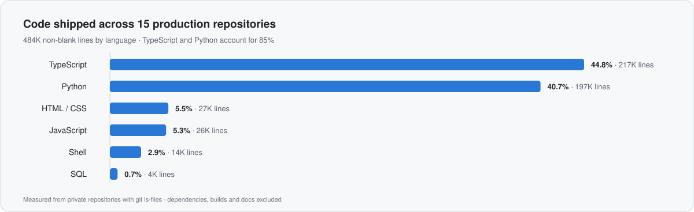

<picture>
  <source media="(prefers-color-scheme: dark)" srcset="assets/header-dark.svg">
  
</picture>

  <a href="https://italofabiosinisiq.github.io/-dev-holaMundo-true-/"><b>Portfolio</b></a>
  &nbsp;·&nbsp;
  <a href="https://www.linkedin.com/in/italo-fabio-sinisi-quintana/"><b>LinkedIn</b></a>
  &nbsp;·&nbsp;
  <a href="mailto:sinisiquintanaitalo@gmail.com"><b>Email</b></a>
  &nbsp;·&nbsp;
  <a href="https://wa.me/51977170609"><b>WhatsApp</b></a>

## Profile

I am a Full Stack Developer and Data Analyst with more than five years of experience delivering software that companies run every day. I lead software development for the Business Intelligence area at **Auren**, a mass-consumer goods distributor in Peru. There I design, build and operate the platforms behind last-mile logistics, field sales and executive reporting.

My background is in data analysis, so I start each system from the business metric it must move, and I make sure the result can be measured once it is in production. I work across the full stack: Python and FastAPI services on PostgreSQL, React and React Native clients, ERP integrations, and Docker and GitHub Actions pipelines that keep releases safe.

**Core competencies:** full stack web and mobile development · REST API design · relational data modeling · ERP and GPS integrations · offline-first mobile architecture · CI/CD and automated testing · business intelligence and analytics · AI-assisted development.

**Currently:** studying Systems & Computer Engineering at Universidad Privada del Norte (UPN). Open to remote positions with international teams, freelance engagements and challenging roles in Peru.

## Selected results

<picture>
  <source media="(prefers-color-scheme: dark)" srcset="assets/impact-dark.svg">
  
</picture>

## Featured project — RutaLiquidador

**Last-mile delivery, fleet tracking and route settlement platform.** Designed, built and operated as lead developer at Auren. *Private repository, in daily production use.*

<picture>
  <source media="(prefers-color-scheme: dark)" srcset="assets/case-metrics-dark.svg">
  
</picture>

#### The problem

Every morning the company dispatches trucks across Lima, each with a crew of three to four people and dozens of stops. The office needed a reliable, real-time view of what was delivered, what was rejected and why, and where each truck was. Each route also had to be settled against returns and promotional free goods, a process that is slow and error-prone when done by hand.

#### The solution

A single platform that connects the ERP, the trucks and the office:

- **Driver app (React Native).** Crews receive the day's orders and navigate their route. They confirm each stop as delivered, partially delivered or rejected, with photo evidence, GPS position and line-level quantities. The app works fully offline, encrypts local data with AES-256 and syncs automatically when coverage returns.
- **Operations control tower (React).** 27 views for dispatchers and management: a live fleet map, activity timelines per truck, delivery review, rejection management, route settlement per crew member, attendance verification, and drill-down reporting from period to driver, customer and product.
- **Promotion identification engine.** The ERP exports invoices without the link between each free-goods line and the promotion that generated it. The engine rebuilds that link across 14 promotion types (progressive, tiered, combos and discounts). When a customer rejects part of an order, it recalculates the bonus that still applies, and the mobile app enforces that quantity even offline.
- **Multi-user delivery log.** Several crew members can record deliveries on the same route at once. Conflicts are detected and resolved on the server, and every correction is kept in an audit trail with before and after values.
- **Integrations.** Read-only synchronization with the SQL Server ERP, live truck positions from the GPS tracker, road routing with OSRM on self-hosted Lima maps, and WhatsApp alerts for rejections and partial deliveries.

#### Architecture

<picture>
  <source media="(prefers-color-scheme: dark)" srcset="assets/architecture-dark.svg">
  
</picture>

#### Engineering

- **Testing:** more than 7,700 automated tests across backend (pytest), mobile (Jest) and web (Vitest and Playwright end-to-end), plus mutation testing on each pull request to prove the tests catch real defects.
- **Continuous delivery:** six GitHub Actions workflows gate every release. The deployment kit runs pre-flight checks, a database backup, a smoke test and an automatic rollback path, with about 15 seconds of downtime per release.
- **Performance:** a database audit replaced a non-indexable query pattern used in 16 places, cutting response time from 4.9 s to 7 ms (about 700× faster). Background jobs were moved out of the web process to remove a concurrency bottleneck.
- **Reliability and security:** exact decimal arithmetic for money, row locking and version tokens for offline conflicts, server-side permission checks, JWT sessions with refresh, rate limiting and periodic security, performance and financial audits.

#### Results

- **Order rejection rate reduced from 7% to 1%.**
- Real-time GPS visibility of the whole truck fleet and of served versus pending stops, which improved delivery effectiveness and route times.
- Faster, auditable route settlement, including promotional free goods.

**Stack:** Python · FastAPI · SQLAlchemy (async) · Alembic · PostgreSQL 16 · SQL Server · APScheduler · TypeScript · React 18 · Vite · Tailwind · Leaflet · React Native · Expo · MapLibre · OSRM · Docker · Nginx · GitHub Actions

## Other projects

| Project | Description | Technologies |
|---|---|---|
| **Ventory Multicanal** | Offline-first field sales platform with a mobile app for sellers and supervisors and an administration dashboard. Includes encrypted on-device storage, GPS audit with fake-location detection and device binding. | FastAPI, PostgreSQL, React Native, React, Docker |
| **Portal de Concursos** | Sales incentive platform. Managers define contest rules, and an engine translates them into read-only ERP queries that rank every seller and calculate prizes. | Next.js, FastAPI, SQL Server, Docker |
| **TomaPedidos** | Suggested-order recommendation engine for field sellers, based on repurchase cycles, market-basket affinity and an ML ranker backtested on nine years of sales. *In development.* | Python, PostgreSQL, machine learning |
| **AUSPEX** | Sales supervisor dashboard with real-time KPIs, team rankings and risk alerts. Migrated from Google Apps Script to a typed web and mobile stack. | Node.js, TypeScript, Prisma, PostgreSQL, React Native |
| **AurenPulse** | Usage analytics for leadership: who uses each internal system, how often and for how long, with activity heatmaps, churn detection and Excel export. | FastAPI, PostgreSQL, Docker |
| **Capturas de Preventa** | Scheduled reporting service that renders pre-sales tables per supervisor and category and delivers them to WhatsApp groups, with tests that keep the figures identical to the source. | Python, FastAPI, Playwright, Node.js, Docker |

These systems run in production, so their repositories are private. Architecture and code walkthroughs are available on request.

## Technical skills

| Area | Technologies |
|---|---|
| Backend | Python, FastAPI, SQLAlchemy, Alembic, Pydantic, APScheduler, Node.js, Express, Prisma, REST APIs, JWT |
| Frontend | TypeScript, React, Next.js, Vite, Tailwind CSS, Leaflet, MapLibre, Recharts, ECharts |
| Mobile | React Native, Expo, offline-first synchronization, encrypted local storage, background GPS |
| Data and BI | PostgreSQL, SQL Server, SQLite, ETL pipelines, ERP integration, Pandas, Power BI |
| DevOps and quality | Docker, Docker Compose, Nginx, Linux, GitHub Actions, pytest, Jest, Vitest, Playwright, mutation testing |
| Languages | Python, TypeScript, JavaScript, SQL, Rust |

<picture>
  <source media="(prefers-color-scheme: dark)" srcset="assets/languages-dark.svg">
  
</picture>

## Professional experience

**Full Stack Developer, Business Intelligence** — Auren · Lima, Peru · *December 2025 – Present*
- Lead developer of the Business Intelligence area, responsible for the design, development, deployment and operation of the company's internal platforms.
- Built RutaLiquidador, reducing the order rejection rate from 7% to 1% and adding real-time GPS control of the truck fleet.
- Built the promotion identification engine, field sales applications, a sales incentive platform and analytics dashboards on top of the company ERP.
- Introduced containerized deployments, CI/CD pipelines and automated testing across projects.

**Call Center Data Analyst** — UBYCALL (Pizza Hut) · *February 2023 – November 2024*
- Increased sales conversion by 15% through predictive analysis of customer behavior.
- Automated 80% of manual reporting with Python and SQL and built executive dashboards in Power BI.

**Financial Analyst** — Alfin Banco · *March 2022 – December 2022*
- Developed machine learning credit-scoring models that reduced default losses by 18%.
- Built an automated ETL pipeline processing more than 100,000 transactions per day.

## Education and certifications

- **B.S. Systems & Computer Engineering** — Universidad Privada del Norte (UPN) · *In progress*
- **AWS Certified Solutions Architect – Associate** · *In preparation*
- **Microsoft Certified: Power BI Data Analyst Associate**
- **Certified ScrumMaster (CSM)** — Scrum Alliance
- **Genesys Cloud Certified**
- **EDTEAM** — Python and Data Analysis · SQL Databases · REST API Development
