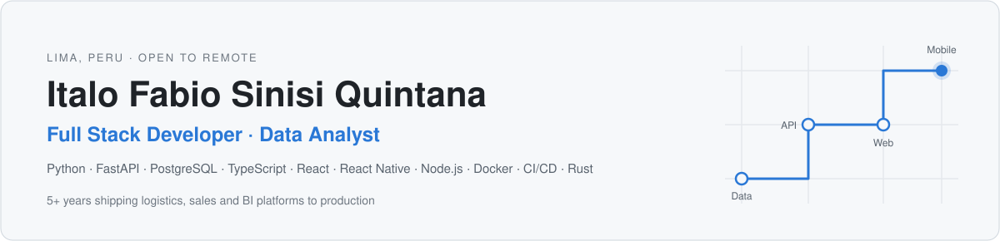
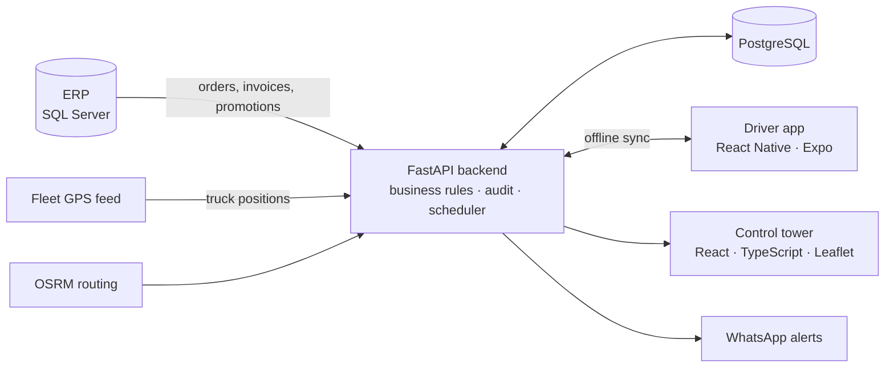

<picture>
  <source media="(prefers-color-scheme: dark)" srcset="assets/banner-dark.svg">
  
</picture>

  
  
  
  

## About

**Full Stack Developer and Data Analyst** with 5+ years of experience. I build production systems end to end: backend APIs, web dashboards, offline-first mobile apps, databases, and the Docker and CI/CD infrastructure that ships them.

I lead software development for the **Business Intelligence** area at **Auren**, a mass-consumer goods distributor in Peru. There I build the platforms that run logistics, last-mile delivery, field sales and executive reporting. Because I started in data analysis, I design every system around a business metric and measure it after launch.

- **Core stack:** Python, FastAPI, PostgreSQL, Docker and GitHub Actions on the backend; TypeScript, React and React Native on the frontend. Rust is my favorite language.
- **How I work:** AI-assisted development (LLMs, MCP, agentic coding) every day, with automated tests and CI on every project.
- **Education:** Systems & Computer Engineering at Universidad Privada del Norte (UPN), in progress.
- **Open to:** remote roles with international teams, freelance projects, and hard problems in logistics, data and automation, in Peru or abroad.

## Impact

<picture>
  <source media="(prefers-color-scheme: dark)" srcset="assets/impact-dark.svg">
  
</picture>

## Featured project

### RutaLiquidador — delivery, GPS tracking and route settlement platform

An end-to-end logistics platform for a mass-consumer distributor. It has a **mobile app for truck drivers**, a **web control tower** for dispatch and operations, and a **central API** connected to the company ERP. *Private repository, running in production.*

```mermaid
flowchart LR
    ERP[("ERP<br/>SQL Server")] -->|orders, invoices, promotions| API
    GPS["Fleet GPS feed"] -->|truck positions| API
    OSRM["OSRM routing"] --> API
    API["FastAPI backend<br/>business rules · audit · scheduler"] <--> DB[("PostgreSQL")]
    API <-->|offline sync| APP["Driver app<br/>React Native · Expo"]
    API --> WEB["Control tower<br/>React · TypeScript · Leaflet"]
    API --> WA["WhatsApp alerts"]
```

- **Cut the order rejection rate from 7% to 1%.** Drivers and dispatchers see every order, customer and delivery state in real time.
- **Real-time GPS tracking of the truck fleet.** Customers already served are identified automatically, which made routes shorter and deliveries more effective.
- **Promotion identification engine.** The ERP exports invoices without the link between each free-goods line and its promotion. The engine rebuilds that link across 14 promotion types (progressive N+M, tiered, combos, discounts) and recalculates bonuses when a customer rejects part of an order. It is written as pure functions, covered by tests and validated against real dispatches.
- **Offline-first driver app** with maps, photo evidence, biometric login and deferred sync.
- **Engineering quality:** hundreds of automated tests (pytest and Jest), mutation testing, six GitHub Actions pipelines, Dockerized releases and Sentry monitoring.

`Python` `FastAPI` `PostgreSQL` `SQL Server` `SQLAlchemy` `React` `TypeScript` `React Native` `Expo` `MapLibre` `OSRM` `Docker` `GitHub Actions`

## Selected work

<table>
  <tr>
    <td width="50%" valign="top">
      <h4>Ventory Multicanal</h4>
      Offline-first field sales platform: a mobile app for sellers and supervisors and an admin dashboard. Encrypted on-device storage (AES-256), GPS audit with fake-location detection, device binding, biometric login and automatic sync.
        
      <code>FastAPI</code> <code>PostgreSQL</code> <code>React Native</code> <code>React</code> <code>Docker</code>
    </td>
    <td width="50%" valign="top">
      <h4>Portal de Concursos</h4>
      Sales incentive platform. Managers define contest rules (products, product groups, volume and coverage goals), and an engine turns them into read-only queries against ERP sales to rank every seller and calculate prizes.
        
      <code>Next.js</code> <code>FastAPI</code> <code>SQL Server</code> <code>SQLite</code> <code>Docker</code>
    </td>
  </tr>
  <tr>
    <td width="50%" valign="top">
      <h4>TomaPedidos</h4>
      Suggested-order recommendation engine for field sellers. It combines repurchase cycles, market-basket affinity and an ML ranker, backtested on nine years of sales history. <i>In progress.</i>
        
      <code>Python</code> <code>PostgreSQL</code> <code>Machine Learning</code>
    </td>
    <td width="50%" valign="top">
      <h4>AUSPEX</h4>
      Sales supervisor dashboard with real-time KPIs, team rankings and risk alerts. Migrated from Google Apps Script to a typed web and mobile stack.
        
      <code>Node.js</code> <code>TypeScript</code> <code>Prisma</code> <code>PostgreSQL</code> <code>React Native</code>
    </td>
  </tr>
  <tr>
    <td width="50%" valign="top">
      <h4>AurenPulse</h4>
      Usage analytics for leadership on top of self-hosted Umami: who uses each internal system, for how long and how often. Includes activity heatmaps, churn detection and Excel export.
        
      <code>FastAPI</code> <code>PostgreSQL</code> <code>Docker</code>
    </td>
    <td width="50%" valign="top">
      <h4>Capturas de Preventa</h4>
      Reporting automation that renders pre-sales tables as images for each supervisor and category, then sends them to WhatsApp groups on a schedule. Formatting is covered by tests so the numbers always match the source.
        
      <code>Python</code> <code>FastAPI</code> <code>Playwright</code> <code>Node.js</code> <code>Docker</code>
    </td>
  </tr>
</table>

Most of my work runs in production for the companies I build for, so these repositories are private. **60+ more repositories** cover ETL bots, BI dashboards, database documentation tools and integrations. I'm happy to walk through the architecture and code in an interview.

## Tech stack

<picture>
  <source media="(prefers-color-scheme: dark)" srcset="assets/languages-dark.svg">
  
</picture>

  

| Area | Technologies |
|---|---|
| Backend | Python, FastAPI, SQLAlchemy (async), Alembic, Pydantic, APScheduler, Node.js, Express, Prisma, REST APIs, JWT |
| Frontend | React, TypeScript, Next.js, Vite, Leaflet, MapLibre, Recharts, ECharts |
| Mobile | React Native, Expo, offline-first sync, encrypted SQLite, GPS, camera, biometrics |
| Data and BI | PostgreSQL, SQL Server, SQLite, ETL pipelines, ERP integration, Pandas, Power BI |
| DevOps | Docker, Docker Compose, GitHub Actions CI/CD, Nginx, Linux servers, Sentry, mutation testing |
| Integrations | OSRM routing, GPS telematics, WhatsApp gateways, Google Sheets API, MCP servers |

## Experience

**Full Stack Developer, Business Intelligence** · Auren · *Dec 2025 – Present*
- Lead developer for the BI area: design, build and deploy the internal platforms behind logistics, sales and executive reporting.
- Built RutaLiquidador, which **cut order rejections from 7% to 1%** and added real-time GPS control of the truck fleet.
- Built the promotion identification engine, field sales apps, a sales incentive platform and analytics dashboards on top of the company ERP (SQL Server to PostgreSQL).
- Run Docker-based deployments and GitHub Actions CI/CD on the company's own servers.

**Call Center Data Analyst** · UBYCALL (Pizza Hut) · *Feb 2023 – Nov 2024*
- **Raised sales conversion by 15%** with predictive analysis of customer behavior.
- **Automated 80% of manual reporting** with Python and SQL, and built executive dashboards in Power BI.

**Financial Analyst** · Alfin Banco · *Mar 2022 – Dec 2022*
- Built machine learning credit-scoring models that **reduced default losses by 18%**.
- Developed an automated ETL pipeline processing **100K+ transactions a day**.

## Education and certifications

- **Systems & Computer Engineering** · Universidad Privada del Norte (UPN) · *In progress*
- **AWS Certified Solutions Architect – Associate** · *Coming soon*
- **Microsoft Certified: Power BI Data Analyst Associate**
- **Certified ScrumMaster (CSM)** · Scrum Alliance
- **Genesys Cloud Certified**
- **EDTEAM:** Python and Data Analysis · SQL Databases · REST API Development

---

  Have a challenging project in mind? Let's talk. 
  <a href="https://italofabiosinisiq.github.io/-dev-holaMundo-true-/">Portfolio</a> ·
  <a href="https://www.linkedin.com/in/italo-fabio-sinisi-quintana/">LinkedIn</a> ·
  <a href="mailto:sinisiquintanaitalo@gmail.com">sinisiquintanaitalo@gmail.com</a>

